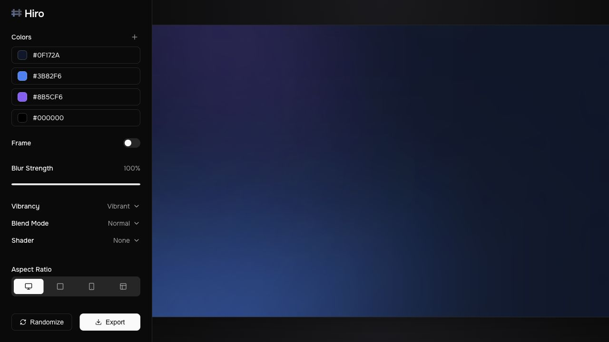
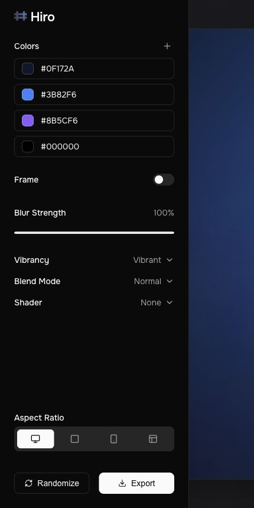

# Hiro Gradients

Hiro Gradients is a parametric background generator for creating polished gradient images, shader-backed previews, export bundles, and API-rendered SVGs. The project includes a React design tool, a reusable JavaScript API, and a lightweight Node HTTP API built on the same core gradient configuration.

## Screenshots

### Desktop Designer



### Compact Layout



## Highlights

- Interactive React gradient designer with color controls, blur, blend modes, aspect ratios, shader options, and export.
- Canvas renderer for the browser UI.
- Seedable palette generation with harmonic, Farbvelo-style, fettepalette, rampensau, and poline-based strategies.
- Shared metadata for ratios, vibrancy levels, blend modes, shader options, shader presets, and API limits.
- JavaScript API for creating, validating, randomizing, and rendering gradient configs.
- HTTP API for metadata, validation, random config generation, SVG rendering, HTML snippets, React snippets, and OpenAPI discovery.
- Browser export flow that can download a ZIP with PNG, standalone HTML, README, and shader React component assets.
- Node test coverage for the public API and HTTP server.

## Project Structure

```text
.
├── api/
│   └── http.js                  # Node HTTP API adapter
├── docs/
│   └── screenshots/             # README screenshots
├── src/
│   ├── api/                     # Shared public API modules
│   ├── App.jsx                  # React design tool
│   ├── GradientCanvas.jsx       # Browser canvas preview
│   ├── ShaderPreview.jsx        # Shader-backed browser preview
│   ├── exportBackground.js      # Browser export bundle/download flow
│   └── gradientRenderer.js      # Core canvas renderer
├── test/
│   └── api.test.js              # Node test runner API coverage
└── server.js                    # API server entry point
```

## Requirements

- Node.js compatible with Vite 8. The current Vite/plugin engine range expects `^20.19.0 || >=22.12.0`.
- npm.

## Installation

```sh
npm install
```

## Run The Designer

```sh
npm run dev
```

Open the local Vite URL printed by the command, usually:

```text
http://127.0.0.1:5173/
```

## Run The HTTP API

```sh
npm run api
```

The API listens on `http://127.0.0.1:8787` by default.

Override host or port:

```sh
HOST=0.0.0.0 PORT=9000 npm run api
```

## Designer Workflow

1. Edit the palette with hex inputs or color pickers.
2. Toggle the frame and adjust blur strength.
3. Choose vibrancy, blend mode, shader, and shader preset.
4. Switch between `16:9`, `1:1`, `9:16`, and `Web` aspect ratios.
5. Click `Randomize` for a new generated composition.
6. Click `Export` to download a reusable ZIP bundle.

The canvas renderer uses this shared config shape:

```js
{
  colors: ['#0f172a', '#3b82f6', '#8b5cf6', '#000000'],
  width: 1920,
  height: 1080,
  seed: 0.5,
  isBlurred: true,
  blurStrength: 100,
  blendMode: 'source-over',
  showRing: false,
  activeShader: 'none',
  activePreset: '',
  presetParams: {}
}
```

## JavaScript API

Import from `src/api/index.js` when using the local project as a library:

```js
import {
  createGradientConfig,
  createRandomGradientConfig,
  listGradientMetadata,
  renderGradientAsSvg,
} from './src/api/index.js';

const config = createRandomGradientConfig({
  seed: 'launch',
  count: 4,
  vibrancy: 'normal',
  ratio: '16:9',
  includeShader: false,
});

const normalized = createGradientConfig(config);
const svg = renderGradientAsSvg(normalized);
const metadata = listGradientMetadata();
```

The browser canvas renderer is also exported directly:

```js
import { renderGradient } from './src/gradientRenderer.js';

const canvas = document.querySelector('canvas');
renderGradient(canvas.getContext('2d'), {
  colors: ['#0f172a', '#3b82f6', '#8b5cf6'],
  width: canvas.width,
  height: canvas.height,
  seed: 0.42,
  isBlurred: true,
  blurStrength: 80,
  blendMode: 'dynamic',
  showRing: false,
});
```

### Public API Modules

- `constants.js` - defaults, limits, ratios, vibrancy values, and blend modes.
- `palettes.js` - palette generators and palette distance utilities.
- `random.js` - seeded random helpers.
- `shaders.js` - shader options and preset metadata.
- `validation.js` - input normalization and validation errors.
- `svgRenderer.js` - server-safe SVG rendering adapter.
- `snippets.js` - standalone HTML and React shader snippet generation.
- `openapi.js` - OpenAPI 3.1 document builder.
- `gradients.js` - high-level public API facade.

## HTTP API

### Endpoints

| Method | Path | Description |
| --- | --- | --- |
| `GET` | `/api/health` | Health check. |
| `GET` | `/api/meta` | Ratios, limits, blend modes, vibrancy values, shaders, presets, and defaults. |
| `GET` | `/api/openapi.json` | OpenAPI 3.1 contract. |
| `POST` | `/api/gradients` | Validate and normalize a gradient config. |
| `POST` | `/api/gradients/random` | Create a seeded or random gradient config. |
| `POST` | `/api/gradients/validate` | Validate without throwing. |
| `POST` | `/api/gradients/render` | Render a gradient as `image/svg+xml`. |
| `POST` | `/api/gradients/svg` | Alias for SVG rendering. |
| `POST` | `/api/gradients/html` | Create standalone replication HTML. |
| `POST` | `/api/gradients/react` | Create a React shader snippet for shader-backed gradients. |

### Generate A Random Config

```sh
curl -X POST http://127.0.0.1:8787/api/gradients/random \
  -H 'content-type: application/json' \
  -d '{"seed":"launch","count":4,"vibrancy":"normal","ratio":"16:9","includeShader":false}'
```

### Render SVG

```sh
curl -X POST http://127.0.0.1:8787/api/gradients/render \
  -H 'content-type: application/json' \
  -d '{"colors":["#0f172a","#3b82f6","#8b5cf6"],"width":1280,"height":720,"seed":0.42}' \
  > gradient.svg
```

### Validate A Config

```sh
curl -X POST http://127.0.0.1:8787/api/gradients/validate \
  -H 'content-type: application/json' \
  -d '{"colors":["#0f172a","#3b82f6"],"ratio":"Web","blendMode":"dynamic"}'
```

### Generate Standalone HTML

```sh
curl -X POST http://127.0.0.1:8787/api/gradients/html \
  -H 'content-type: application/json' \
  -d '{"colors":["#0f172a","#3b82f6","#8b5cf6"],"width":1440,"height":900,"seed":0.25}' \
  > hiro-gradient.html
```

## Rendering Notes

- Browser UI rendering uses `canvas` through `renderGradient`.
- HTTP rendering returns SVG so the API can run without native canvas dependencies.
- Shader previews and shader-inclusive PNG exports are browser-backed because `@paper-design/shaders-react` renders through React/WebGL-style browser surfaces.
- Seeded random API calls are deterministic for the shared palette generators.

## Scripts

```sh
npm run dev       # Start the Vite designer
npm run api       # Start the Node HTTP API
npm run build     # Production build
npm run preview   # Preview the production build
npm run lint      # ESLint
npm run test      # Node API tests
npm run test:api  # Same API test suite
```

## Verification

Run the core checks:

```sh
npm run test
npm run lint
npm run build
```

The production build may warn about a large JavaScript chunk because the UI includes React, shader packages, animation, and color tooling. That warning does not fail the build.

## Development Notes

- Keep server-only code out of the React entry path.
- Keep browser-only export logic in `src/exportBackground.js` and component modules.
- Use `src/api` for pure, reusable API logic.
- Add endpoint tests in `test/api.test.js` when expanding the HTTP surface.
- The `scratch/` directory contains local experiments and is intentionally ignored by ESLint.

## License

No license file is currently included.
